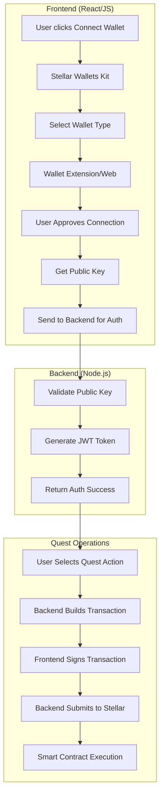

# Stellar Wallet Integration Flow

## Overview

This document outlines the complete flow for integrating Stellar wallets in the Apollo Quest Manager system, including wallet connections, transaction signing, and smart contract interactions.

## Architecture



## 1. Wallet Connection Flow

### Frontend Implementation

```javascript
// Install: npm install @creit.tech/stellar-wallets-kit
import { StellarWalletsKit, WalletNetwork, ISupportedWallet } from '@creit.tech/stellar-wallets-kit';

class WalletService {
  constructor() {
    this.kit = new StellarWalletsKit({
      network: WalletNetwork.TESTNET, // or WalletNetwork.PUBLIC for mainnet
      selectedWalletId: undefined,
      modules: await StellarWalletsKit.getSupportedWallets()
    });
  }

  async connectWallet() {
    try {
      // 1. Get available wallets
      const supportedWallets = await this.kit.getSupportedWallets();
      
      // 2. User selects wallet (Freighter, Albedo, Rabet, etc.)
      const selectedWallet = supportedWallets.find(wallet => 
        wallet.id === 'freighter' && wallet.isAvailable
      );
      
      if (!selectedWallet) {
        throw new Error('Wallet not available');
      }

      // 3. Set active wallet
      this.kit.setWallet(selectedWallet.id);
      
      // 4. Get user's public key
      const { address } = await this.kit.getAddress();
      
      // 5. Authenticate with backend
      const authResult = await this.authenticateWithBackend(address);
      
      return {
        publicKey: address,
        wallet: selectedWallet,
        token: authResult.token
      };
    } catch (error) {
      throw new Error(`Wallet connection failed: ${error.message}`);
    }
  }

  async authenticateWithBackend(publicKey) {
    const response = await fetch('/api/v1/auth/wallet/connect', {
      method: 'POST',
      headers: {
        'Content-Type': 'application/json'
      },
      body: JSON.stringify({
        publicKey,
        userName: `User-${publicKey.substring(0, 8)}`
      })
    });

    if (!response.ok) {
      throw new Error('Backend authentication failed');
    }

    return await response.json();
  }
}
```

### Backend Authentication Endpoint

```typescript
// POST /api/v1/auth/wallet/connect
async connectWallet(req: Request, res: Response): Promise<Response> {
  const { publicKey, userName } = req.body;

  // Validate public key format
  if (!publicKey || !publicKey.startsWith('G')) {
    return ResponseHelper.error(res, 'Invalid Stellar public key', 400);
  }

  // Generate JWT token
  const token = AuthHelper.generateToken({
    address: publicKey,
    role: 'user',
    authMethod: 'wallet',
    publicKey: publicKey
  });

  return ResponseHelper.success(res, {
    token,
    user: {
      id: publicKey,
      userName: userName || `User-${publicKey.substring(0, 8)}`,
      publicKey: publicKey,
      authMethod: 'wallet',
      connectedAt: new Date()
    }
  }, 'Wallet authentication successful');
}
```

## 2. Quest Registration Flow

### Frontend Quest Registration

```javascript
class QuestService {
  constructor(walletService, authToken) {
    this.walletService = walletService;
    this.authToken = authToken;
  }

  async registerForQuest(questId) {
    try {
      // 1. Request transaction from backend
      const txResponse = await fetch(`/api/v1/auth/wallet/quest/${questId}/build-register`, {
        method: 'POST',
        headers: {
          'Authorization': `Bearer ${this.authToken}`,
          'Content-Type': 'application/json'
        },
        body: JSON.stringify({
          publicKey: this.walletService.publicKey
        })
      });

      const { transactionXdr } = await txResponse.json();

      // 2. Sign transaction with wallet
      const signedTransaction = await this.signTransaction(transactionXdr);

      // 3. Submit signed transaction to backend
      const submitResponse = await fetch(`/api/v1/auth/wallet/quest/${questId}/register`, {
        method: 'POST',
        headers: {
          'Authorization': `Bearer ${this.authToken}`,
          'Content-Type': 'application/json'
        },
        body: JSON.stringify({
          signedTransactionXdr: signedTransaction.signedTxXdr,
          publicKey: this.walletService.publicKey
        })
      });

      const result = await submitResponse.json();
      return result;

    } catch (error) {
      throw new Error(`Quest registration failed: ${error.message}`);
    }
  }

  async signTransaction(transactionXdr) {
    try {
      // This triggers wallet popup for user approval
      const signedTransaction = await this.walletService.kit.signTransaction(transactionXdr, {
        networkPassphrase: WalletNetwork.TESTNET,
        address: this.walletService.publicKey
      });

      return signedTransaction;
    } catch (error) {
      if (error.message.includes('User rejected')) {
        throw new Error('Transaction was rejected by user');
      }
      throw new Error(`Transaction signing failed: ${error.message}`);
    }
  }
}
```

### Backend Transaction Building

```typescript
// POST /api/v1/auth/wallet/quest/:questId/build-register
async buildQuestRegistrationTransaction(req: Request, res: Response): Promise<Response> {
  const questId = Number(req.params.questId);
  const { publicKey } = req.body;

  try {
    // Build unsigned transaction
    const transactionXdr = await this.stellarWalletService.buildQuestRegistrationTransaction(
      publicKey,
      questId
    );

    return ResponseHelper.success(res, {
      transactionXdr,
      questId,
      instructions: {
        message: 'Transaction ready for signing',
        nextStep: 'Sign transaction with your wallet'
      }
    });
  } catch (error) {
    return ResponseHelper.error(res, (error as Error).message, 500);
  }
}

// POST /api/v1/auth/wallet/quest/:questId/register
async registerForQuestWithWallet(req: Request, res: Response): Promise<Response> {
  const questId = Number(req.params.questId);
  const { signedTransactionXdr, publicKey } = req.body;

  try {
    // Validate and submit signed transaction
    const result = await this.stellarWalletService.submitSignedTransaction(signedTransactionXdr);

    return ResponseHelper.success(res, {
      registered: true,
      questId,
      transactionHash: result.hash,
      status: 'SUCCESS'
    }, 'Quest registration completed successfully');
  } catch (error) {
    return ResponseHelper.error(res, (error as Error).message, 500);
  }
}
```

## 3. Smart Contract Integration

### Contract Transaction Building

```typescript
// src/services/stellarWalletService.ts
async buildQuestRegistrationTransaction(userAddress: string, questId: number): Promise<string> {
  try {
    // Load user account
    const account = await this.server.loadAccount(userAddress);
    
    // For Soroban smart contracts (future implementation)
    // const contract = new StellarSdk.Contract(contractAddress);
    // const operation = contract.call('register_for_quest', ...args);
    
    // Current implementation uses manage data operation
    const transaction = new StellarSdk.TransactionBuilder(account, {
      fee: StellarSdk.BASE_FEE,
      networkPassphrase: this.networkPassphrase,
    })
      .addOperation(StellarSdk.Operation.manageData({
        name: `quest_${questId}_register`,
        value: Buffer.from(JSON.stringify({
          action: 'register',
          questId,
          timestamp: Date.now(),
          version: '1.0'
        }))
      }))
      .setTimeout(300) // 5 minutes timeout
      .build();

    return transaction.toXDR();
  } catch (error) {
    throw new Error(`Failed to build transaction: ${error.message}`);
  }
}
```

### Soroban Smart Contract Integration (Advanced)

```typescript
// Future Soroban contract integration
async buildSorobanQuestTransaction(userAddress: string, questId: number, contractId: string): Promise<string> {
  try {
    const account = await this.server.loadAccount(userAddress);
    
    // Create contract instance
    const contract = new StellarSdk.Contract(contractId);
    
    // Build contract call operation
    const operation = contract.call(
      'register_for_quest',
      StellarSdk.nativeToScVal(questId, { type: 'u64' }),
      new StellarSdk.Address(userAddress).toScVal()
    );

    // Build transaction
    const transaction = new StellarSdk.TransactionBuilder(account, {
      fee: StellarSdk.BASE_FEE,
      networkPassphrase: this.networkPassphrase,
    })
      .addOperation(operation)
      .setTimeout(300)
      .build();

    // Prepare for Soroban
    const preparedTransaction = await this.server.prepareTransaction(transaction);
    
    return preparedTransaction.toXDR();
  } catch (error) {
    throw new Error(`Failed to build Soroban transaction: ${error.message}`);
  }
}
```

## 4. Complete Integration Example

### React Component Example

```jsx
import React, { useState } from 'react';
import WalletService from './services/WalletService';
import QuestService from './services/QuestService';

function QuestManager() {
  const [wallet, setWallet] = useState(null);
  const [authToken, setAuthToken] = useState(null);
  const [loading, setLoading] = useState(false);

  const connectWallet = async () => {
    setLoading(true);
    try {
      const walletService = new WalletService();
      const connection = await walletService.connectWallet();
      
      setWallet(connection);
      setAuthToken(connection.token);
      
      console.log('Wallet connected:', connection.publicKey);
    } catch (error) {
      console.error('Connection failed:', error.message);
      alert(`Failed to connect wallet: ${error.message}`);
    } finally {
      setLoading(false);
    }
  };

  const registerForQuest = async (questId) => {
    if (!wallet || !authToken) {
      alert('Please connect your wallet first');
      return;
    }

    setLoading(true);
    try {
      const questService = new QuestService(wallet, authToken);
      const result = await questService.registerForQuest(questId);
      
      console.log('Quest registration result:', result);
      alert(`Successfully registered for quest ${questId}!`);
    } catch (error) {
      console.error('Registration failed:', error.message);
      alert(`Registration failed: ${error.message}`);
    } finally {
      setLoading(false);
    }
  };

  return (
    <div>
      <h2>Apollo Quest Manager</h2>
      
      {!wallet ? (
        <button onClick={connectWallet} disabled={loading}>
          {loading ? 'Connecting...' : 'Connect Stellar Wallet'}
        </button>
      ) : (
        <div>
          <p>Connected: {wallet.publicKey.substring(0, 8)}...</p>
          <button onClick={() => registerForQuest(1)} disabled={loading}>
            {loading ? 'Processing...' : 'Register for Quest #1'}
          </button>
        </div>
      )}
    </div>
  );
}

export default QuestManager;
```

## 5. Error Handling & User Experience

### Common Error Scenarios

1. **Wallet Not Installed**
   ```javascript
   if (!selectedWallet.isAvailable) {
     throw new Error('Please install Freighter wallet extension');
   }
   ```

2. **User Rejects Transaction**
   ```javascript
   try {
     const signed = await kit.signTransaction(xdr);
   } catch (error) {
     if (error.message.includes('User rejected')) {
       alert('Transaction was cancelled by user');
       return;
     }
     throw error;
   }
   ```

3. **Network Issues**
   ```javascript
   try {
     const result = await submitTransaction(signedXdr);
   } catch (error) {
     if (error.message.includes('timeout')) {
       alert('Network timeout. Please try again.');
     } else if (error.message.includes('insufficient funds')) {
       alert('Insufficient XLM balance for transaction fees');
     }
   }
   ```

## 6. Testing Flow

### Local Testing Setup

1. **Install Freighter Wallet** (Chrome Extension)
2. **Create Test Account** on Stellar Laboratory
3. **Fund Account** using Friendbot
4. **Test Connection Flow**

```bash
# Start backend
cd apollo-back
npm run dev

# Start frontend  
cd apollo-frontend
npm start

# Test endpoints
curl -X POST http://localhost:3000/api/v1/auth/wallet/connect \
  -H "Content-Type: application/json" \
  -d '{"publicKey": "GXXXXXXXXXXXXXXX"}'
```

## 7. Security Considerations

- **Never store private keys** on backend
- **Always validate transactions** before submission  
- **Use HTTPS** in production
- **Implement rate limiting** for API endpoints
- **Validate JWT tokens** on protected routes
- **Sanitize user inputs** to prevent injection attacks

## 8. Production Deployment

### Environment Configuration

```typescript
// config/stellar.ts
export const stellarConfig = {
  networkPassphrase: process.env.NODE_ENV === 'production' 
    ? StellarSdk.Networks.PUBLIC 
    : StellarSdk.Networks.TESTNET,
  
  horizonUrl: process.env.NODE_ENV === 'production'
    ? 'https://horizon.stellar.org'
    : 'https://horizon-testnet.stellar.org',
    
  sorobanUrl: process.env.NODE_ENV === 'production'
    ? 'https://soroban-rpc.mainnet.stellar.gateway.fm'
    : 'https://soroban-testnet.stellar.org'
};
```

This flow ensures secure, user-friendly wallet integration while maintaining proper separation between frontend wallet management and backend transaction processing.